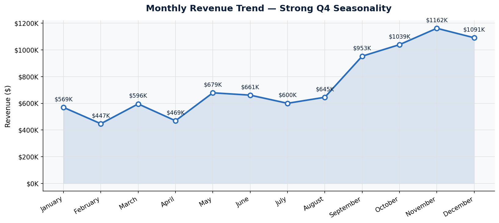
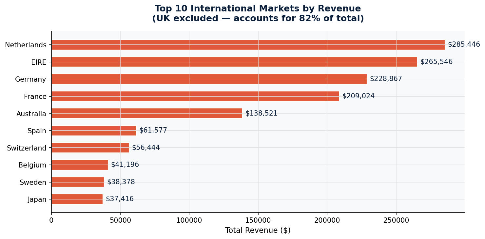
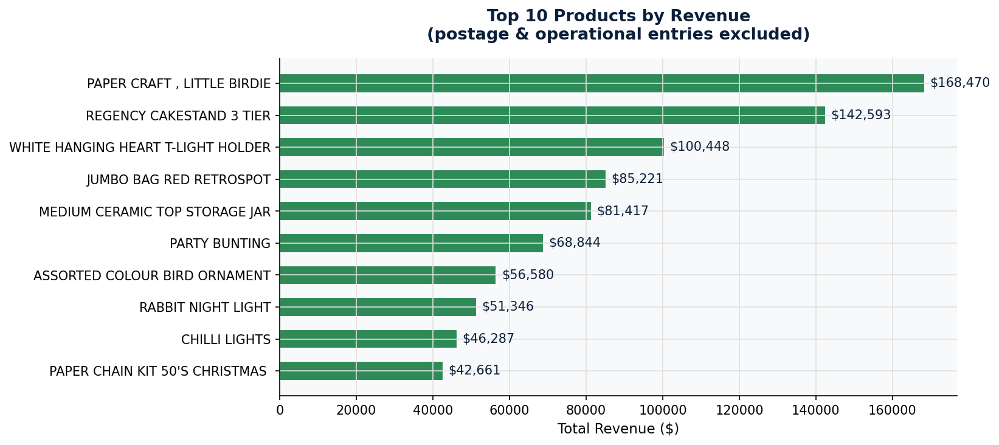
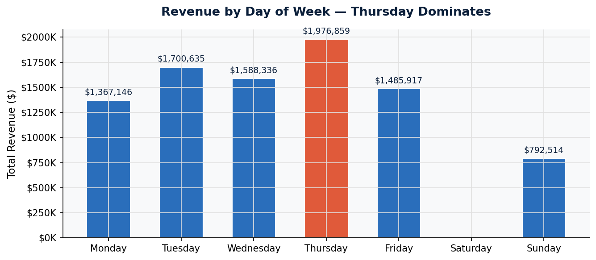
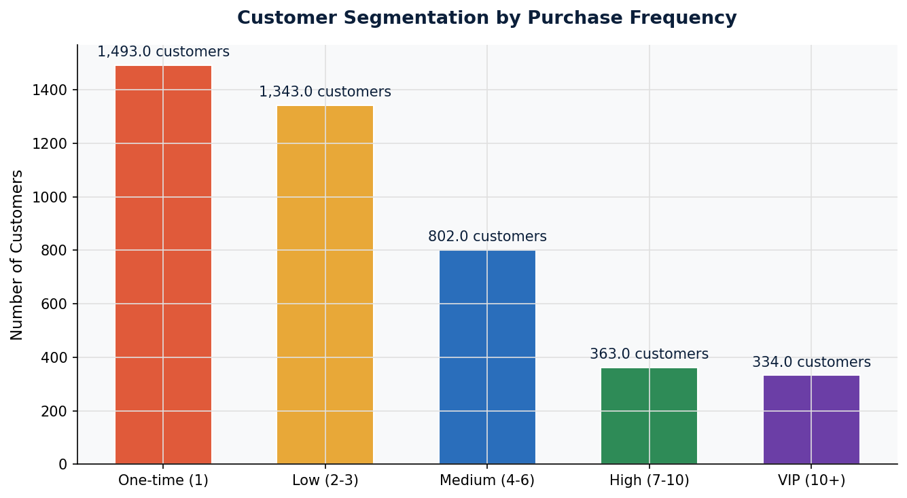

# E-Commerce Sales & Customer Behavior Analysis

**Analyst:** Praneeth Sholapur  
**Tools:** Python · pandas · SQLite · matplotlib · Tableau  
**Dataset:** 541,909 transactions · 38 countries · 4,372 customers · 4,070 products · Dec 2010 – Dec 2011  

🔴 **[View Live Tableau Dashboard](https://public.tableau.com/app/profile/praneeth.sholapur/viz/E-CommerceSalesAnalysisPraneethSholapur/Dashboard1)**

---

## Business Question

> *Where is revenue coming from, which customers are most valuable, and where should the business focus for growth?*

A UK-based e-commerce retailer selling home décor and gift products across 38 countries wants to understand its revenue patterns, customer behavior, and international growth opportunity.

---

## How I Worked on This Project

| Task | My Role | AI Assistance |
|------|---------|---------------|
| Define business questions | Me | — |
| Data cleaning & anomaly detection | Me | Used Claude to flag edge cases (cancellations, negative quantities) |
| SQL & Python analysis | Me | Used Claude to speed up query structuring |
| Chart design & storytelling | Me | — |
| Tableau dashboard design | Me | — |
| Executive recommendations | Me | Used Claude to format summary structure |

> **Every insight, every pattern I flagged, every recommendation — that's my analysis. AI helped me move faster, not think for me.**

---

## Key Findings

### 1. 82% revenue concentration in a single market
UK generates $9M+ of $10.6M total revenue. With 38 countries available, this is a strategic single-point-of-failure risk — not a strength.

### 2. International customers have 3x higher order value
Singapore averages $3,040 per order, Netherlands $3,037 — vs significantly lower UK retail averages. International buyers are wholesale/B2B, not retail.

### 3. Top product list is contaminated with operational entries
"DOTCOM POSTAGE" ($206K) sits at #1 — it's a shipping charge, not a product. Any product manager using the raw report would be misled. I flagged and filtered these before analysis.

### 4. 25% of transactions have no CustomerID
135,080 records are anonymous — invisible to retention, loyalty, and personalization efforts. A structural data capture problem, not a data quality issue.

### 5. Q4 drives 27% of annual revenue
November + December alone generate $2.97M. February drops to $523K — less than 35% of peak month volume. No off-season retention strategy is visible in the data.

### 6. Thursday dominates trading — Saturday doesn't exist
Thursday is the highest revenue day. The business has zero Saturday transactions — likely B2B wholesale buyers operating on business schedules, not retail consumers.

---

## Visualisations

| Chart | Insight |
|-------|---------|
|  | Revenue peaks in Q4 — 27% of annual sales in Nov-Dec |
|  | International markets ex-UK — Europe dominates volume |
|  | Top products after removing operational entries |
|  | Thursday & Tuesday are peak trading days |
|  | Customer segmentation by purchase frequency |

---

## Live Tableau Dashboard

🔴 **[Click here to interact with the full dashboard](https://public.tableau.com/app/profile/praneeth.sholapur/viz/E-CommerceSalesAnalysisPraneethSholapur/Dashboard1)**

The dashboard includes:
- Monthly revenue trend with Q4 seasonality visible
- International revenue map (UK excluded to show spread)
- Top 10 products by revenue
- Revenue by day of week
- Top 10 countries by revenue

---

## Business Recommendations

**Recommendation 1 — Capture customer identity at every touchpoint**  
25% anonymous transactions = 25% of customers invisible to any retention effort.  
*Action:* Mandatory email capture at checkout. Even guest checkout should require an email.  
*Expected impact:* Full customer visibility, enabling loyalty programs and re-engagement campaigns.

**Recommendation 2 — Build a dedicated B2B wholesale program**  
International customers average 3x UK order values — they're wholesale buyers, not retail shoppers.  
*Action:* Create a B2B account tier with bulk pricing, dedicated account managers, and priority stock access.  
*Expected impact:* International revenue growing from 18% to 25% = ~$600K+ additional annual revenue.

**Recommendation 3 — Reduce Q4 revenue concentration**  
27% of revenue in 2 months creates cash flow risk and operational strain.  
*Action:* Target Q4 customers with Q1-Q2 re-engagement campaigns using purchase history data.  
*Expected impact:* 15% lift in slow months reduces seasonal dependency and improves year-round stability.

---

## How to Run This Analysis

```bash
# Install dependencies
pip install pandas matplotlib seaborn

# Open the notebook
jupyter notebook ecommerce_analysis.ipynb
```

Run all cells top to bottom. Charts save automatically as PNG files.

---

## Files in This Repo

| File | Description |
|------|-------------|
| `ecommerce_analysis.ipynb` | Full analysis — SQL, Python, charts, analyst commentary |
| `data.csv` | Source dataset (541,909 transactions) |
| `chart1_monthly_revenue.png` | Monthly revenue trend |
| `chart2_international_revenue.png` | International markets revenue map |
| `chart3_top_products.png` | Top 10 products by revenue |
| `chart4_day_of_week.png` | Revenue by day of week |
| `chart5_customer_segments.png` | Customer segmentation |

---

*Praneeth Sholapur · Data & Business Analyst · California, USA*  
*[Portfolio](https://praneeth7-bot.github.io) · [LinkedIn](https://linkedin.com/in/praneeth-sholapur-1b89062a3) · [Tableau Public](https://public.tableau.com/app/profile/praneeth.sholapur)*
